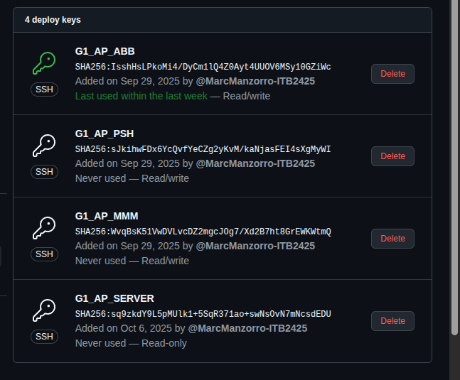
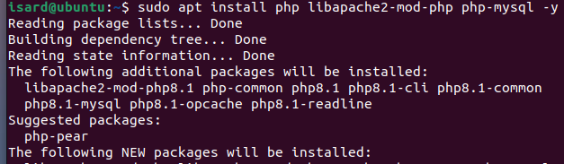
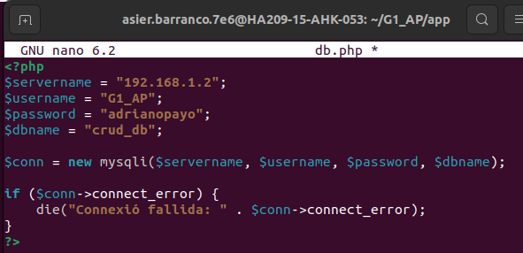
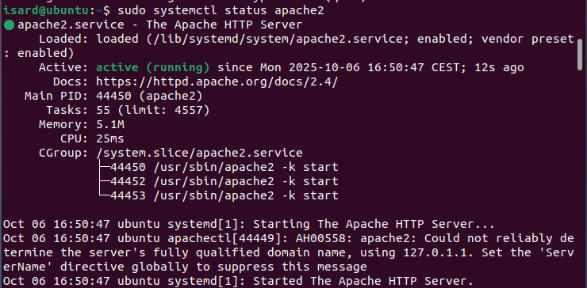
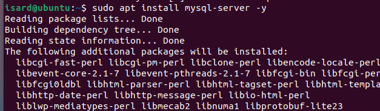
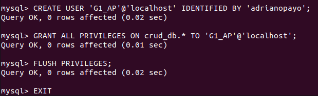
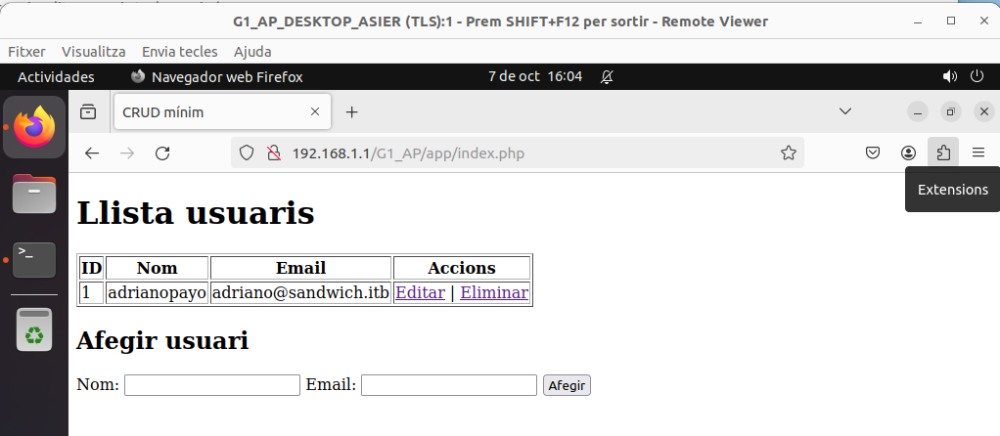
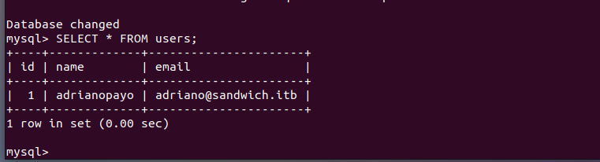

# 📊 Proyecto BDD - Documentación

---
## 1.Configuracion de git y repositorios:
 1. Añadir las claves para que los compañeros y el server tengan acceso:
 

## 🌐 2. Configuración de IPs

### 🛠 Pasos Realizados:
1. Distribución de las máquinas entre los compañeros:  
   - 2 Servidores  
   - 3 Clientes
2. Asignar **IP estática** a cada máquina.
./images/image4.png
3. Aplicar la configuración y **reiniciar servicios de red** si es necesario.
  
4. Verificar la **conectividad entre todas las máquinas** mediante ping u otras pruebas.

---

## 🖥 4. Instalación de Servicios

### 💻 Servidor Web
1. Actualizar el **sistema operativo**.  
2. Instalar **Apache y PHP**.

3. Iniciar y habilitar los servicios. 

 

4. Verificar que **Apache y PHP** funcionan correctamente.

 

### 🗄 Servidor Base de Datos
1. Actualizar el **sistema operativo**.  
2. Instalar **MySQL Server**.  
 
3. Crear la **base de datos y usuario** para la aplicación.  
 

4. Configurar **MySQL** para aceptar conexiones externas.  
5. Reiniciar MySQL y verificar su correcto funcionamiento.

---

## 🚀 5. Despliegue de la Aplicación

### 🛠 Pasos:
1. Copiar o **clonar el código** al servidor web.  
2. Configurar el **archivo de conexión a la base de datos** (config.php).  
3. Probar la **conexión PHP a la base de datos**.  
4. Verificar que la **aplicación se carga correctamente** en el navegador.

 

 

---

## 🐞 7. Identificación y Corrección de Bugs

### 🔧 Pasos:
1. Revisar el código en busca de errores o fallos.  
2. Corregir los errores en los **archivos correspondientes**.  
3. Crear **commits separados** para cada corrección.  
4. Verificar que **cada corrección funciona correctamente**.

---

## ✅ 8. Verificación Final

### 🔎 Pasos:
1. Confirmar que el **cliente puede acceder al servidor web**.  
2. Confirmar que el **servidor web se conecta correctamente** a la base de datos.  
3. Comprobar que **todos los bugs han sido corregidos**.  
4. Revisar **logs** y probar **funcionalidades clave** de la aplicación.

---
